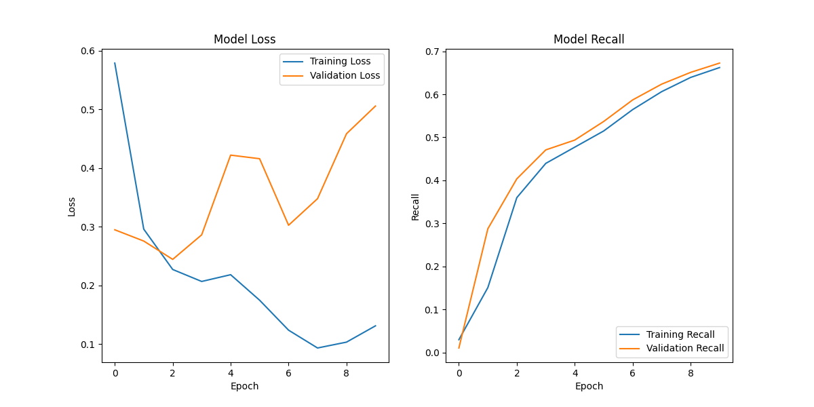

# Milestone 3

## Evaluating the Model

The train and test loss and recall are as follows:

| | Loss | Recall
| --- | --- | --- 
| Train | 0.295 | 0.689
| Test | 0.372 | 0.702

The training loss (0.295) is lower than the test loss (0.372). This means that our model may be overfitting, fitting well to the training data but not as well to the test data.

The training recall and test recall are similar, so our recall is consistent across both datasets. The model is able to correctly identify positive cases, so it is not overfitting here.

## Fitting Graph and Our Next Models

From the fitting graph we can see the following:

Epochs 0-3: Both training and validation loss continue to decrease. Recall increases. Here, the model is learning.

Around Epoch 4: Training loss continues to decrease. Validation reaches its minimum.

Epoch 4-10: Validation loss increases while training loss decreases, suggesting overfitting. Recall is increasing but not as steeply as the previous epochs.

For our next model we first want to decrease overfitting. We also want to try to focus on the precision for our 'nay' class, as described in the next section.

We will to try using logistic regression, which although simpler, should not overfit as much. We will try k-fold cross validation to see if overfitting is more reduced generally. We are also trying to see if we can implement some type of ensemble method to improve our model.

## Conclusion of the First Model

The model is trained for 10 epochs on a designated congressman, and the train and test set are split as 8:2. Below are the overall performances:

1. Accuracy:

   Overall accuracy is 0.89, indicating that the model correctly predicts the voting decision ("Yea" or "Nay") 89% of the time.

2. Precision, Recall, and F1 Score:

   | | Precision | Recall | F1
   | --- | --- | --- | ---
   | Yea | 0.97 | 0.89 | 0.93
   | Nay | 0.58 | 0.86 | 0.69

4. Loss:

   Training loss: 0.0468

   Validation loss: 0.0991

In conclusion, the model reaches high a high Precision, Recall and F1-Score. It still has some drawbacks in predicting the ‘Nay’ class since the performance is not as good as predicting the ‘Yea’ class. We think the reason for this is that the training data for ‘Nay’ class is much less than the data for ‘Yea’ class, which cause the insufficient learning of the ‘Nay’ class. More data would be helpful to increase the performance on ‘Nay’ class.

## Possible Improvements**

Below are the possible improvements that could enhance the performance of the model.

1. Address Class Imbalance:

   The "Nay" class has lower precision, recall, and F1-score compared to the "Yea" class. This indicates a potential class imbalance issue. There are mainly 2 ways to solve this problem.

   - Resampling Methods: Use techniques like SMOTE (Synthetic Minority Over-sampling Technique) to balance the classes.

   - Class Weights: Assign higher weights to the minority class ("Nay") when compiling the model.

2. Hyper parameter Tuning:

   We can use techniques like Grid Search or Random Search to find optimal hyper parameters, such as learning rate, batch size, and number of epochs.

3. Model Complexity:

   The model has a large number of neurons in each layer. We can consider reducing the number of neurons to simplify the model and prevent overfitting. A possible solution is adding L2 regularization to the Dense layers to penalize large weights and reduce overfitting.

4. Early Stopping:

   We can implement early stopping to prevent overfitting by monitoring the validation loss and stopping training when it stops improving.

5. Feature Engineering:

   We can also perform additional feature engineering to create more meaningful input features for the model by considering domain-specific knowledge to derive new features.
