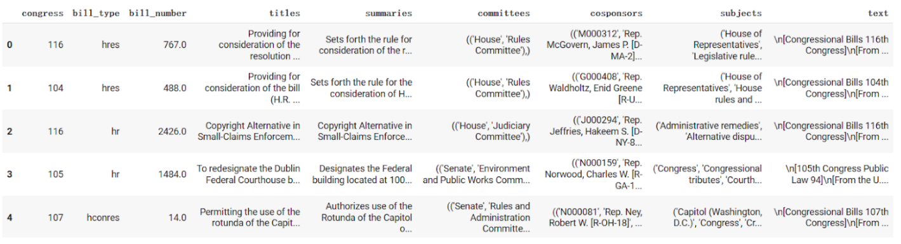
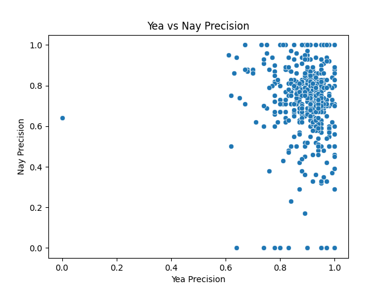
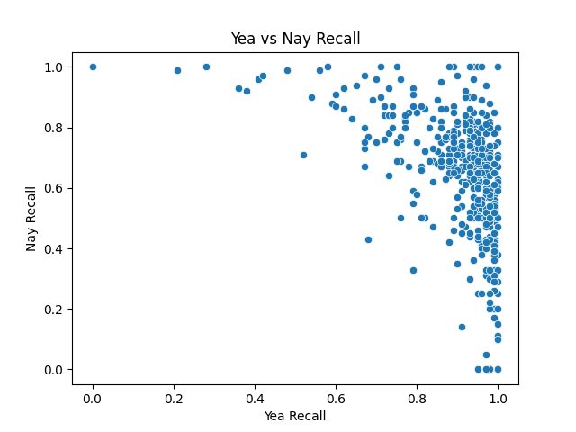
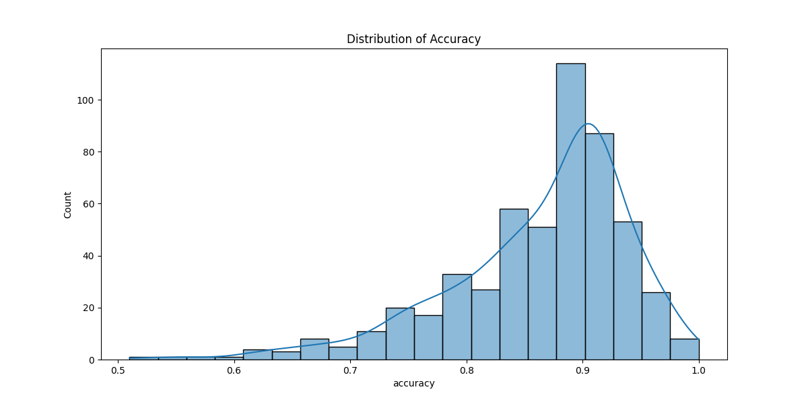

## Introduction

It is known that five hundred and thirty five congressmen are designated to decide the laws of this country by voting yea/nay. Given the information of a certain bill, it would be beneficial if we can predict the votes of those congressmen, since both the bill’s proponents and the public would respond proactively based on the anticipated outcomes. In this project, we create a machine learning model to predict how a congressman is likely to vote given a particular bill. A large database of bills and the corresponding votes by each congressman are gathered and processed. Various features of the bills, such as their content, sponsors, and historical voting patterns, are taken into account. A sophisticated neural network model is trained using supervised learning on the processed data. Given a new bill, our model predicts how each congressman is likely to vote, which can inform whether a bill is likely to pass. This prediction can be valuable for political analysts, lawmakers, and the general public in understanding legislative dynamics and potential outcomes.

## Methods

### Data Exploration

The data mainly contains two parts, the congressman and the bill.

1. Congressman Data

The congressman data includes 535 files, each representing a congressman’s voting history. The table below shows the content of one congressman file, which has 4 features including the category, congress, type, and number of the bills voted by a certain congressman, and 1 output showing the congressman’s voting position.

| Index | Category            | Congress | Bill Type | Bill Number | Vote Position |
|-------|---------------------|----------|-----------|-------------|---------------|
| 0     | passage             | 113      | hr        | 803.0       | Nay           |
| 1     | passage-suspension  | 113      | hr        | 324.0       | Yea           |
| 2     | passage-suspension  | 113      | hjres     | 72.0        | Yea           |
| 3     | passage-suspension  | 113      | hr        | 1073.0      | Yea           |
| 4     | passage             | 113      | hr        | 45.0        | Nay           |

2. Bill data

The bill data is one whole file containing information of all the bills that all the congressmen voted for. The table below shows the content of the bill file, which has 9 features including the congress, type, title, summaries, committees, cosponsors, subjects, and text of the bills.

The size of the congressman data is roughly 100 KB * 500 = 50MB, while the size of the bill data is 442 MB. The size difference between the two types of data is because the ‘summaries’ and ‘text’ fields take up too much space. Instead of concatenating the congressman and text field to generate 500 files with all the information, we decided to merge each time we trained the model, which consumes little time and avoids lots of redundant data storage.

## Preprocessing

### Data Cleaning
**Removing N/A**
Some rows of both the congressman and the bill data contain N/A, which might affect the model training process. We removed the rows containing N/A by using the code billinfo.dropna(axis=0,how='any',inplace=True).

**Removing Redundant Titles**
The ‘titles’ field of bill data contains many repeated titles. We remove them by using a python set.

**Removing HTML Tags**
The ‘text’ field of bill data includes many HTML tags such as `
`, `
`, `<i>`, `</i>`, and so on. We remove them using the replace method of Python string.

### One-hot Encoding
For features with discrete values, we choose the one-hot encoding to represent the feature so the model understands the difference.  We do one-hot encoding to ‘category’, ‘congress’, and ‘bill type’.

### Text Feature Representation
For text-based features, we investigated mainly 2 methods to handle them, the first is TF-IDF word bag and the second is word embedding. 

**TF-IDF**
The TF-IDF is a numerical statistic used in information retrieval and text mining to reflect the importance of a word in a document relative to a collection or corpus of documents by combining the term frequency and inverse document frequency. It’s simple to achieve TF-IDF feature representation but the performance is not as good as other more complex methods.

**Word Embedding**
Word embedding is a technique used in natural language processing (NLP) and machine learning to represent words as dense, continuous vectors in a high-dimensional space. Since it’s trained with a neural network, it shows great performance in representing text features, which was proven by scientific papers. Considering the training cost of the word embedding model, we consider using a pre-trained model to get the embedding directly. We test both BERT[1] and DistilBERT[2] to process the text. By comparing their performance, we conclude that BERT reaches higher accuracy while consuming more computational cost, while DistilBERT reaches relatively lower accuracy while consuming less computational cost. Considering the time cost of developing 500 models for 500 congressmen, we choose DistilBERT to do the text feature extraction.

## Model Design
Considering the high accuracy of the neural network, we developed a neural network to perform the classification. The model includes an input layer, 6 hidden layers and an output layer. Below is a detailed description of those layers.

### Input Layer
The input layer accepts an input shape extracted from the shape of training data.

### Hidden Layer
The hidden layers are all dense (fully connected) layers and are stacked using the Sequential method to extract higher-level features progressively. The first hidden layer contains 8192 neurons, the second hidden layer contains 4096 neurons, the third hidden layer contains 2048 neurons, the fourth hidden layer contains 1024 neurons and the fifth contains 512 neurons while the sixth contains 256 neurons. All the hidden layers use ReLU as the activation function. 

### Output Layer
The output layer only has a single neuron to produce a probability score indicating the likelihood of the positive class in the binary classification. This layer uses sigmoid as the activation function.

### Parameters
The parameters used in training are below.

Optimizer: Adam
Loss Function: binary_crossentropy
Batch Size: 32
Dropout: No

## Results

As we trained 535 models, one for each congressman, we ended up with 535 accuracy, precision, and recall scores.

Here are scatter plot visualizations on the precision and recall for the Yea vs Nay vote.

Here is a histogram showing the accuracy distribution of the model.

Here are some statistics of these precision, recall,  extracting during the training process.

|        | Yea Precision | Yea Recall | Yea F1 Score | Nay Precision | Nay Recall | Nay F1 Score | Accuracy |
|--------|---------------|------------|--------------|---------------|------------|--------------|----------|
| Mean   | 0.899301      | 0.909263   | 0.899395     | 0.713875      | 0.643611   | 0.656465     | 0.863875 |
| 25%    | 0.880000      | 0.890000   | 0.880000     | 0.670000      | 0.540000   | 0.620000     | 0.830000 |
| 50%    | 0.920000      | 0.950000   | 0.930000     | 0.750000      | 0.700000   | 0.700000     | 0.890000 |
| 75%    | 0.950000      | 0.970000   | 0.950000     | 0.830000      | 0.770000   | 0.760000     | 0.910000 |

## Visualization
### Welcome Page
The welcome page is the initial page the user see when entering the website. It enables users to select the congress number, the bill type and the bill number, and once users click the ‘predict!’ button, they’re redirected to the loading page. Here’s a screenshot of the  welcome page:

### Prediction Page
The prediction page shows the prediction results for each congressman. The center of the page shows how many congressmen are estimated to vote ‘yea’ and ‘nay’. Below the overall prediction, the webpage shows all the information about the senators, showing their photos, the parties, and the states they belong to. Above the webpage are four buttons, providing the sorting method users like, including ‘sort alphabetical’, ‘sort by party’, ‘sort by state’ and ‘sort by vote’. This helps users to quickly search for the information they need.

### Implementation Details
The website for visualizing our predictions was built using Python Flask with additional templates for user interface elements. The Flask application includes routes to serve various pages such as the index, loading, and congressman results pages. Form submissions from the index page initiate a background task to process the data and update progress in real-time using SocketIO. This task fetches bill information, makes predictions using the models in the DistilBERT directory, and updates the congressman page with the results. Real-time updates are managed through SocketIO events, providing users with progress updates and redirecting them once processing is complete. Error handling ensures that any issues, such as missing data or prediction errors, are logged and managed appropriately. The application is designed to run on all network interfaces with customizable port settings, and it uses ngrok for secure tunneling and bypassing browser warnings during development and testing.

## Discussion

We will discuss the rationale behind our choices, interpret our results, and reflect on the process from beginning to end.

**Data Preprocessing:**
One of the strengths was the effective preprocessing of a large amount of textual data. We used advanced work vectorizers and converted textual information into numeric representations, so that we could input it into the neural network. This allowed us to use as much information about the bills as we wanted to, including the entire text, the committees, the subjects, etc. Using DistilBERT also resulted in better performance compared to methods like TF-IDF.

**Large File Sizes:**
One major challenge we had to deal with was the large file sizes of our datasets. More specifically, the bill data was enormous because of the 'summaries' and 'text' fields. So as mentioned previously, we only purged the congressman and bills data during the training process, so that we didn’t have to save the large files anywhere. This however increased the computational intensity of the project.

**Computational Intensity:**
A critical decision we made was to create 535 separate models for each congressman, instead of one single model. This helped us tailor the predictions to the individual voting patterns of the congressman, but due to the large file size, it was computationally intensive and required about 200gb of storage. But using this method, we were able to achieve a high level of precision and recall for the ‘yea’ votes, and a high accuracy in general.

**Model Performance:**
Our model’s performance, indicated by precision, recall, and F1-score, has a disparity between ‘yea’ and ‘nay’ predictions.

|        | Yea Precision | Yea Recall | Yea F1 Score | Nay Precision | Nay Recall | Nay F1 Score | Accuracy |
|--------|---------------|------------|--------------|---------------|------------|--------------|----------|
| Mean   | 0.899301      | 0.909263   | 0.899395     | 0.713875      | 0.643611   | 0.656465     | 0.863875 |

The model performed well in predicting 'yea' votes, with high precision and recall, but struggled more with 'nay' votes. This discrepancy could be due to various factors, including class imbalance or inherent differences in the voting patterns for 'yea' and 'nay' votes.

**Improvement Strategies:**
To address the lower performance for 'nay' predictions, one potential improvement could be to train a single, comprehensive model instead of 535 individual ones. A unified model could benefit from shared learning across all congressmen, allowing it to learn more generalized voting patterns and interactions. This approach might improve the model's ability to make accurate predictions by leveraging the collective voting data, which could help in understanding broader legislative trends and context.

We could also try to add more features, such as age, state, gender or other about the congressmen themselves, to see if that improves accuracy and precision.

## Conclusion
Our project highlights a significant technological advancement in the world of computing. By using large data sets and the content of legislative bills, we were able to create a neural network that can predict the likely decision for a given member of congress for any specific bill.

We carefully cleaned and preprocessed our data, employing techniques such as one-hot encoding for categorical variables and advanced text representation methods like DistilBERT for textual features. Our neural network model shows the potential for high accuracy prediction in voting outcomes.

The creation of 535 individual models, one for each congressman, allows for personalized predictions that account for the unique voting patterns of each legislator. This approach enhances the model's potential for accuracy and practicality.

The addition of an interactive web interface brings value to the project, making the predictions accessible and interpretable for a wide range of users, including political analysts, lawmakers, and the general public. The ability to visualize predictions and sort results by various criteria enhances the utility of our model for understanding legislative dynamics.

However, it is important to acknowledge the limitations of our approach. The model's reliance on historical data means it may not fully capture rapid shifts in political landscapes or unexpected voting behaviors. Additionally, the ethical implications of using predictive models in the democratic process warrant careful consideration.

Future work could focus on:
Incorporating real-time data to improve the model's responsiveness to current events
Exploring ensemble methods to potentially increase prediction accuracy
Developing interpretable AI techniques to provide clearer insights into the factors driving predictions
Expanding the model to cover state legislatures or international parliamentary systems
Conducting longitudinal studies to assess the model's performance over time and across different political climates

Our model, with the ability to predict voting patterns, represents a powerful new tool in the realm of understanding and analyzing processes in legislation. With this ability, however, it is important to stay mindful of its potential impacts on the political space and the repercussions wrongful use could have. This technology should be used in ways that enhance the already potent human abilities in ways that help us grow. This project demonstrates a way in which data can be used to help better understand legislation and the patterns that occur within.

## Statement of Collaboration
Name: Title: Contribution.

Yuting Peng, coding & writing, did the coding of embedding and built a prediction model, finished part of the report.

Logan Corrente, coding/writing, helped create scripts to pull data, cleaned code for notebooks and models, and finished part of the report.

Vedika, coding/writing, did testing/training, preprocessing, finished part of the report, finalized submissions, notebooks, research

Suraj Laddagiri, coding & writing, built the model, did the training, built the website

## Citations
[1] Devlin, Jacob, et al. "Bert: Pre-training of deep bidirectional transformers for language understanding." arXiv preprint arXiv:1810.04805 (2018).
[2] Sanh, Victor, et al. "DistilBERT, a distilled version of BERT: smaller, faster, cheaper and lighter." arXiv preprint arXiv:1910.01108 (2019).
